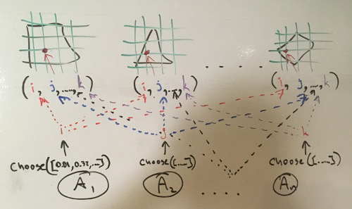

POMDP
=====

Cooperative decision making.

One decision needs to be made, but N interested parties are involved and want
to maximise independent interests.

We map the decision space onto an N-dimensional space and allow each party
(agent) an independent choice of a position on a single dimension of the space.

1. N-dimensional coordinate space;
2. N agents (one per dimension);
3. All agents see the same coordinate space;
4. Each agent maps an independent problem to this shared coordinate space;
5. Repeat until all agents converge (frequency of choosing of a particular
   position reaches threshold (epsilon)):
    1. Each agent chooses a position on its assigned dimension that valuates
       (relative to this agent's independent interests) higher or equal to
       previously-chosen position;
    2. Each agent adjusts the probabilities of each possible position to
       slightly favor the chosen one (the coefficient parameter);
    3. Each agent checks whether it converged (the probability of any single
       position has approached threshold (the epsillon parameter));
6. Return the set of chosen positions (i.e. the coordinates).

Agents see the same grid (decision space), but different goals underneath it
(the problem spaces):


Test runs
---------

```sh
$ time ./bin/test -gen 5 5 ran -e 0.1

Result | Count | Percent | Rank
-------+-------+---------+-------
   182 |     0 |      0% |    22
   370 |     0 |      0% |    18
   104 |     0 |      0% |    23
   423 |     0 |      0% |    14
    14 |     0 |      0% |    25
   393 |     0 |      0% |    17
   439 |     0 |      0% |    12
   401 |     0 |      0% |    16
   289 |     0 |      0% |    20
   217 |     0 |      0% |    21
   428 |     0 |      0% |    13
   344 |     0 |      0% |    19
    20 |     0 |      0% |    24
   412 |     1 |      0% |    15
   615 |     2 |      0% |     9
   641 |     5 |      0% |     8
   606 |     8 |      0% |    10
   678 |     9 |      0% |     7
   500 |    11 |      1% |    11
   685 |    47 |      4% |     6
   723 |    50 |      5% |     5
   885 |   115 |     11% |     3
   869 |   177 |     17% |     4
   921 |   249 |     24% |     2
   949 |   326 |     32% |     1
=================================

Trials:
    1000

Iterations per trial:
    min  20
    max  56
    mean 26

./bin/test -gen 5 5 ran -e 0.1  0.02s user 0.00s system 95% cpu 0.022 total

$ time ./bin/test -gen 5 5 ran -e 0.01

Result | Count | Percent | Rank
-------+-------+---------+-------
   182 |     0 |      0% |    22
   370 |     0 |      0% |    18
   104 |     0 |      0% |    23
   606 |     0 |      0% |    10
   423 |     0 |      0% |    14
   685 |     0 |      0% |     6
   723 |     0 |      0% |     5
    14 |     0 |      0% |    25
   393 |     0 |      0% |    17
   439 |     0 |      0% |    12
   401 |     0 |      0% |    16
   641 |     0 |      0% |     8
   885 |     0 |      0% |     3
   289 |     0 |      0% |    20
   217 |     0 |      0% |    21
   412 |     0 |      0% |    15
   428 |     0 |      0% |    13
   344 |     0 |      0% |    19
   615 |     0 |      0% |     9
   678 |     0 |      0% |     7
   500 |     0 |      0% |    11
    20 |     0 |      0% |    24
   869 |     1 |      0% |     4
   921 |    68 |      6% |     2
   949 |   931 |     93% |     1
=================================

Trials:
    1000

Iterations per trial:
    min  437
    max  733
    mean 465

./bin/test -gen 5 5 ran -e 0.01  0.17s user 0.01s system 99% cpu 0.178 total

$ time ./bin/test -gen 5 5 ran -e 0.001

Result | Count | Percent | Rank
-------+-------+---------+-------
   182 |     0 |      0% |    22
   370 |     0 |      0% |    18
   104 |     0 |      0% |    23
   606 |     0 |      0% |    10
   423 |     0 |      0% |    14
   685 |     0 |      0% |     6
   723 |     0 |      0% |     5
   869 |     0 |      0% |     4
    14 |     0 |      0% |    25
   393 |     0 |      0% |    17
   439 |     0 |      0% |    12
   401 |     0 |      0% |    16
   641 |     0 |      0% |     8
   885 |     0 |      0% |     3
   289 |     0 |      0% |    20
   217 |     0 |      0% |    21
   412 |     0 |      0% |    15
   428 |     0 |      0% |    13
   344 |     0 |      0% |    19
   921 |     0 |      0% |     2
   615 |     0 |      0% |     9
   678 |     0 |      0% |     7
   500 |     0 |      0% |    11
    20 |     0 |      0% |    24
   949 |  1000 |    100% |     1
=================================

Trials:
    1000

Iterations per trial:
    min  6682
    max  6955
    mean 6712

./bin/test -gen 5 5 ran -e 0.001  2.43s user 0.01s system 99% cpu 2.439 total
```
